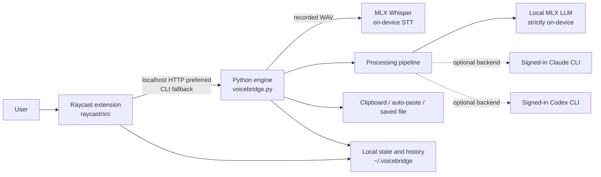

# Alfred high-level design

## 1. Purpose and scope

Alfred is a macOS, Apple-Silicon-focused voice and text transformation tool. A
user records speech or supplies text, the system transcribes it when needed,
optionally translates and reshapes it for an intent, then delivers the result to
the clipboard, the active application, or a file. It supports Hebrew and other
Whisper-supported languages.

The architecture deliberately separates a reusable local engine from the user
interface. This lets the Raycast front end offer its full capabilities without
duplicating transcription, configuration, LLM, or delivery logic.

## 2. Architecture overview

### Major components

| Component | Responsibility |
| --- | --- |
| `voicebridge.py` | System of record for CLI commands, configuration, STT, streaming sessions, optional LLM processing, output delivery, history, progress, and the local HTTP daemon. |
| `raycast/` | TypeScript/Raycast integration: Dictate, Transcribe Only, text transformation, intents, history, menu bar, and status views. |
| `config.toml` | User-controlled configuration. Loaded from `~/.config/voicebridge/config.toml`, with an engine-local fallback. `config.example.toml` documents supported settings. |
| `sox` | Captures microphone input as the daemon-contract WAV format: 16 kHz, mono, signed 16-bit WAV. |
| MLX Whisper | On-device transcription. The model is loaded and retained by the daemon where possible. |
| LLM adapters | Run enabled translation, rewrite, optimization, or feedback refinement using the local MLX LLM by default, or the user's authenticated Claude/Codex CLI when selected. |

## 3. Core processing flows

### Dictation

1. The front end starts `sox` and creates a temporary WAV recording.
2. When the warm daemon is available, the front end sends `stream-start` and
   the engine incrementally transcribes the growing WAV. It emits partial
   transcript state for a live UI preview.
3. On stop, the front end calls `stream-finish`; otherwise it invokes the
   one-shot `process` command. The engine completes transcription.
4. The engine applies the configured stages: translation, rewrite-to-intent,
   and optimization. Stages may be combined into one LLM call or run separately.
5. The engine records history before attempting delivery, then copies, pastes,
   or saves the final result and returns a machine-readable status.

### Text transformation

The `text` command follows the same processing and delivery path without STT.
It accepts text from an argument or standard input. A feedback/refinement
instruction bypasses the normal stage composition and asks the selected backend
to revise the supplied result while preserving everything else.

### Long input handling

Before LLM processing, long text is split at paragraph and sentence boundaries
using a conservative budget derived from `local_max_tokens`. Outputs are joined
while retaining paragraph boundaries. This prevents a long recording from being
silently truncated by the local model's generation limit.

## 4. Engine interfaces and contract

The engine is both a command-line program and an optional loopback daemon. The
front end uses the daemon for low latency and falls back to spawning the CLI
when it is unavailable.

| Interface | Contract |
| --- | --- |
| CLI | `voicebridge.py <command> [options]`; principal commands include `process`, `stream-start`, `stream-finish`, `text`, `history`, `modes`, `settings`, `doctor`, `contract`, and configuration update commands. |
| Daemon | `voicebridge.py serve --port 8763` by default. `POST /` accepts `{"argv": ["..."]}` and returns `{"code": int, "out": str, "err": str}`. `GET /` returns daemon identity and `GET /contract` returns the active contract. |
| Result protocol | Front-end-driven capture commands finish with `VB_RESULT` (JSON text) followed by a final `VB_STATUS` line. Status reports `copied`, `saved`, `empty`, `streaming`, or `error` and may include failure detail. |
| State files | Atomic, owner-only JSON files publish progress and stream previews. History is stored as owner-only JSONL. The `contract` command supplies paths and schemas, including config-aware history location. |

The engine owns this contract in its `CONTRACT` structure. The front end
retrieves it and retains a versioned fallback for older engine versions. Additive contract
changes are expected to be backward compatible; a schema-version major change
signals incompatibility.

## 5. Configuration and intent model

Configuration is merged over built-in defaults. A malformed user TOML file does
not prevent captures: the engine warns and runs with defaults, while `doctor`
reports the parse failure.

The `[processing]` section independently enables `translate`, `rewrite`, and
`optimize`. With all three disabled, text passes through with no LLM call.
`mode` selects a rewrite intent such as `prompt`, `email`, `message`, `commit`,
`notes`, or `raw`. The `[intent]` section can override built-in prompts or add
new modes; the engine exposes the resolved catalog through `modes`, so both UI
pickers remain aligned.

Per-capture flags override configuration. `--transcribe-only` is intentionally
applied last and disables every LLM stage, guaranteeing a raw transcript.

## 6. LLM backend strategy

`local` is the default backend and runs an MLX instruct model on-device. It is
strict: it does not silently fall back to a network-capable backend. `auto`
tries the installed CLI backends in order, while `claude` and `codex` explicitly
select their respective signed-in CLI.

For CLI backends, the engine removes known API-key environment variables before
spawning the command. This avoids reading, storing, or accidentally using an
API key; authentication remains the user's existing CLI login. In daemon mode,
a warm Claude session may be reused to avoid startup latency. Backend calls use
isolated/minimal mode by default and are bounded by configurable timeouts and
warm-session recycling limits.

If an LLM stage fails after successful STT, the engine delivers and records the
raw transcript with an `llm_failed` status suffix. This favors preserving user
speech over failing the complete capture.

## 7. Data, privacy, and security

| Data | Location / handling |
| --- | --- |
| Audio | Temporary WAV during capture; removed after transcription unless `keep_audio` is enabled. |
| Transcript and output | Sent only to the selected LLM backend when an LLM stage is enabled. Local STT and the local backend remain on-device. |
| History | Optional JSONL under `~/.voicebridge/history` by default; bounded by `max_items`. |
| UI state | Progress, stream preview, and daemon discovery files under `~/.voicebridge`. |
| Configuration | User-owned TOML in `~/.config/voicebridge/config.toml`. UI edits use engine commands instead of directly reimplementing config behavior. |

The engine creates sensitive state directories with mode `0700`, writes state
files atomically with mode `0600`, and uses a lock for concurrent history
updates. The HTTP server binds only to `127.0.0.1`, verifies loopback Host
headers, and refuses cross-origin POST requests to reduce DNS-rebinding and
browser-CSRF exposure. It identifies itself before treating an occupied daemon
port as an existing Alfred service.

Auto-paste requires macOS Accessibility permission for the process that owns
the action. Clipboard restoration is configurable and disabled by default for
compatibility. A failed paste is surfaced separately from a successful copy.

## 8. Performance and resilience

- The daemon preloads Whisper and can prewarm the CLI LLM session, removing
  repeated model/CLI startup from normal captures.
- Streaming STT processes speech in silence-aware chunks and writes a live
  preview. Silence gating limits hallucinated transcript text during pauses.
- The threaded HTTP server captures each request's output per thread, so a long
  request does not serialize unrelated commands or mix their output.
- Delivery is separated behind a `Sink` abstraction, allowing clipboard, file,
  and paste routing to be unit tested without OS side effects.
- Progress, preview, and history writes are best effort; their failure does not
  replace a successful primary capture. History is appended before delivery so
  an output failure does not lose an otherwise successful result.
- Errors are converted to a final machine-readable status wherever the front
  end drives the command, including STT, LLM, runtime, and delivery errors.

## 9. Deployment and operations

The repository is script-first rather than a packaged service.
`raycast/install.sh` creates the Python virtual environment, installs
dependencies, writes a starter configuration, and builds/imports the Raycast
extension.

The supported runtime target is an Apple Silicon Mac with Python, `sox`, and
the required macOS microphone/accessibility permissions. The `doctor` command
checks dependencies, model/config state, writable output directories, and warm
daemon identity. `contract`, `settings`, and the state files support front-end
diagnosis without duplicating engine internals.

## 10. Testing boundaries

The project has two complementary test suites:

- Python tests validate the engine, CLI flags, pipeline, streaming, contracts,
  configuration, output delivery, fallback behavior, and HTTP server.
- Vitest tests cover the Raycast engine client and UI logic.

`make test` runs both suites; `make lint` and `make typecheck` provide the
corresponding static checks.
